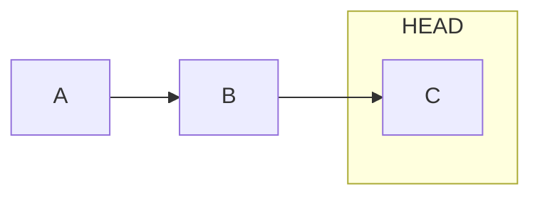
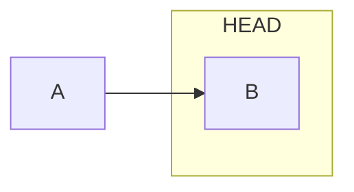
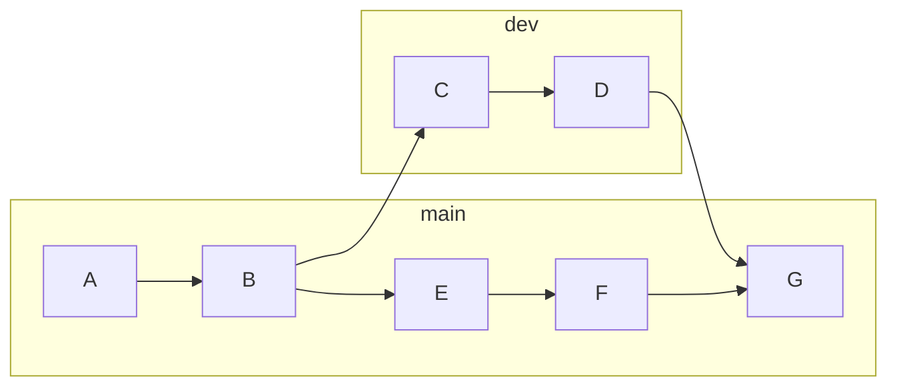
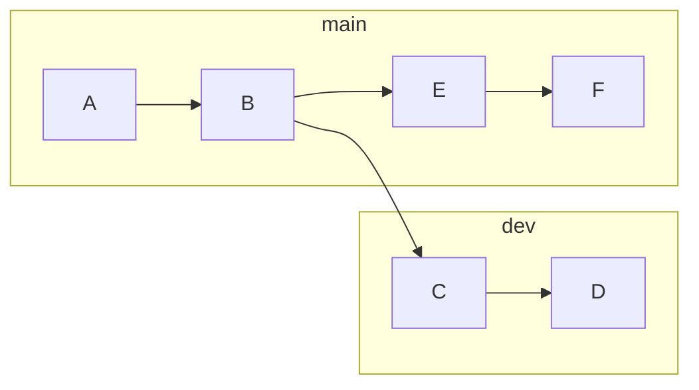
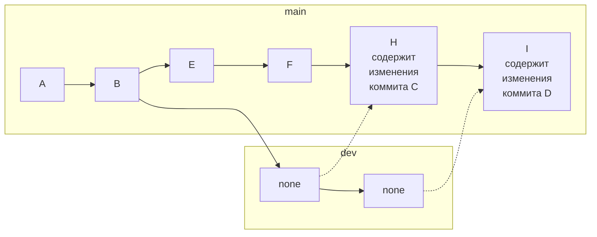
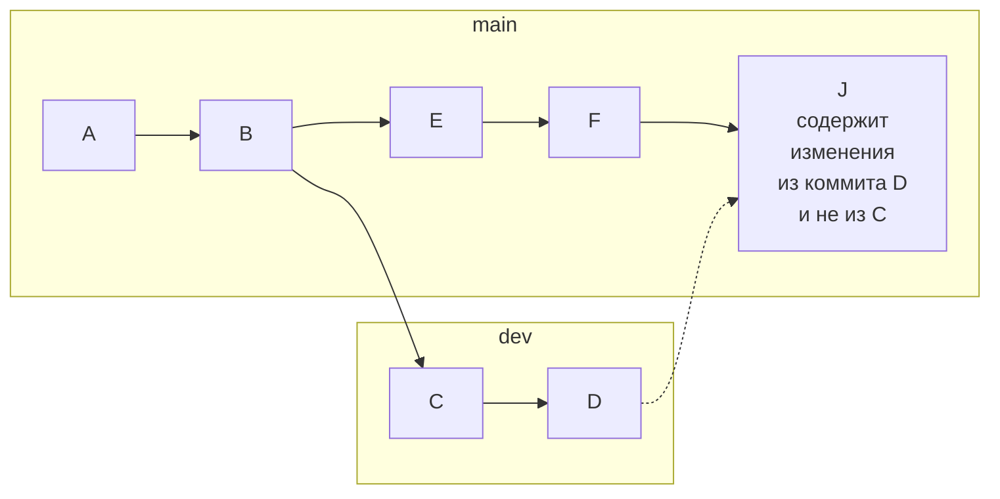

# Работа с изменениями

### Управление состояниями файлов
```bash
# показывает содержимое последнего коммита
git show
```
### Сравнение версий и просмотр изменений
```bash
# просмотр изменений конкретного 1ого файла
git diff <file name>

# просмотр изменений с пред. коммита
git diff

# просмотр изменений между конкретными  коммитами
git diff <1st_comm_hash> <2nd_comm_hash>

# просмотр изменений между конкретными  коммитами конкретного 1ого файла
git diff <1st_comm_hash> <2nd_comm_hash> <file name>

# просмотр истории написания каждой строки файла (н-р кем и когда)
git blame <file name>

```

### .gitignore
```bash
# игнорирование конкретного файла
<file_name>.<format>

# игн. файлов определенных форматов
*.<format>

# игн. папки
<dir_name>/

# игн. файлов определенных форматов в опред. папке
<dir_name>/*.<format>

# если нужно исключить какой-то определенный файл из исключаемых
# пример
logs/*.log
!logs/special.log

# НЕ РАБОТАЕТ следующий пример
logs/
!logs/special.log
```

### Отмена несохраненных изменений
```bash
# возврат изменений ДО использования git add
git restore <file>

# возврат изменений ПОСЛЕ использования команды git add
git restore --staged <file>

# сброс изменений множества файлов (не работает с новыми-созданными файлами - в статусе Untracked)
git reset --hard

# "удаляет"-сбрасывает новые-созданные файлы - в статусе Untracked
git clean -f

# удаление из "отслеживания" - например если забыли добавить файл в .gitignore и файл в репозитории
git rm --cached <file>
```

### Отмена сохраненных изменений
```bash
# удаляет все изменения, внесенные одним коммитом в репозиторий кода - ОТМЕНА конкретного коммита
# команда используется для отмены определенного коммита и создания нового коммита, который отменяет изменения предыдущего коммита.
git revert <hash_comm>

# флаг --no-commit позволяет применить изменения, но не создавать новый коммит.
# Это позволяет проверить изменения перед тем, как закоммитить их.
git revert --no-commit <hash_comm>

```

### Удаление (сброс) изменений

* SOFT
```bash
# общий вид
git reset --soft <hash_comm>
```
ПРИМЕР:

`HEAD` указывает на `C`

```bash
# После выполнения
git reset --soft B
```

`HEAD` будет указывать на `B` и изменения из коммита `C` будут в индексе, как будто вы их добавили командой `git add`.
___
___
* MIXED

```bash
# общий вид
git reset --mixed <hash_comm>

# или (режим --mixed используется по умолчанию)
git reset <hash_comm>
```
ПРИМЕР:

`HEAD` указывает на `C`

```bash
# После выполнения
git reset --mixed B
# или
git reset B
```

`HEAD` будет указывать на `B`, но на этот раз изменения из `C` НЕ будут в индексе.

Есть все изменения из `С`, но если запустить `git status` то вы увидите, что все изменения `not staged`.

Нужно сначала добавить их в индекс командой `git add` и только после этого `git commit`.
___
___
* HARD
```bash
# удаляет изменения и коммиты до указанного коммита
git reset --hard <hash_comm>

# сброс изменений множества файлов (не работает с новыми-созданными файлами - в статусе Untracked)
git reset --hard
```
ПРИМЕР тот же:


Режим `--hard` также как и `--mixed` переместит `HEAD` на `В` и очистит индекс, но `--hard` изменит файлы в  рабочей директории.

Изменения из `С`, равно как и незакоммиченные изменения, будут удалены и файлы в репозитории будут совпадать с `B`.


### Изменение последнего коммита
```bash
# Изменение сообщения последнего коммита
git commit --amend "new comment"

# Изменение последнего коммита без редактирования сообщения самого коммита
git commit --amend --no-edit
```

### Отмена слияния веток
```bash
# отменяет слияние веток и убирает коммит(ы)
git reset --merge <hash_comm до которого нужно откатиться>

# отмена процесса слияния при конфликте
git merge --abort
```

### Откладывание изменений
```bash
# сохраняет в кэш изменения с последнего коммита (те изменения, которые еще не закоммичены)
# файлы будут возвращены в состояние последнего коммита
# не работает на новые созданые файлы
git stash

# "достает" из кэша последние отложенные изменения
# если несколько "отложенных" дел, то команду применять несколько раз
# при выполнении команды происходит Auto-merging (автоматическое слияние)
# команда работает по принципу LIFO
git stash pop

# выводит список всех отложенных изменений
git stash list

# удаляет отложеные изменения из списка отложенных изменений
# возвращает измененные файлы до состояния последнего коммита
git stash drop
```

### Перемещение изменений
* MERGE
```bash
# общий вид
git merge <branch>
```

Коммит `G` будет содержать все изменения, которые накопились в ветке `dev` (из коммитов `C` и `D`).

Если ветку `dev` удалить, то история всех изменений НЕ сохранится.
___
___

* REBASE

```bash
# общий вид
git rebase <branch>
```


История изменений коммитов остается.

Но в будущем будет сложно понять, что был именно `git rebase`.
___
___
* CHERY-PICK

```bash
# общий вид
git cherry-pick <hash_comm>
```
Переносит один(несколько) коммит(ов) без переноса других изменений.
Пример - хотим перенести изменения не из всей ветки `dev`, а только из коммита `D`.

